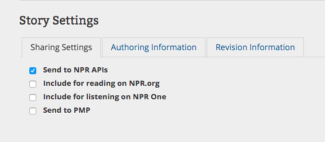

# Basic Use

## Posting a New Episode via Core Publisher or Core Publisher Lite

When PodCastle is set up and running for your show, you can place new episodes on your custom index page just by posting them to Core Publisher. 


 For an episode to appear on your show index page, it will need an **audio file**, a **show description** \(in the body of Core Publisher's text area\), and a **photo** \(placed in Core Publisher's "slideshow" area\).


### Make a New Core Publisher Post

Log in to Core Publisher \(at `your-station.org/user`\), then click "add content" in the top gray menu bar that appears on screen. 

On the next screen, choose "Post."

### Add Your Podcast Content

At this point, you'll proceed to assemble a Core Publisher post normally, using the editor to add show information. 

When making a podcast episode in Core Publisher, it's good to be aware of how the data in this editor will map to what appears on your audience's podcast apps:

* Your headline will become the episode title.
* The first audio file you add to your post will become the episode's audio.
* Text you enter into the main body field will become your "show notes."
* Things specific to web site presentation, like the `<!--break-->` line that separates where home page previews should end \(pictured above\), will not be used.
* The byline, category, and slug fields on individual posts will all be ignored in favor of your program-wide settings.

Generally speaking, your show index page respects these same rules, as we'll discuss in the next section. 


**Watch Out for Weird Formatting**

PodCastle uses the NPR Story API to find your episodes and pull their contents. This means that if a formatting error or other unsupported content prevents NPR from seeing your story, PodCastle won't be able to see it and make your page either.

It also means that, if you're pasting from Microsoft Word or Google Docs, you run the risk of making your page look funny by bringing that formatting with you.

To help combat this, I highly recommend [using an online tool to clear your formatting](http://apps.kbia.org/workingatkbia/videos/05-microsoft-word-to-core-publisher/) before you paste anything into Core Publisher.


### Add PodCastle-Specific Content

Like NPR's podcast feed generator, PodCastle will automatically adapt your article-style post to fit a format more suitable to its presentation. Here's what will happen:

* Your headline will appear on your show index page and episode page as the episode title.
* The first audio file embedded in your article will become the episode's audio file and be available around your show's site for playback.
* The byline, category, and slug fields will all be ignored. 
* The first image in your Core Publisher post will become the episode's primary image and get displayed in quite a few places: at the top of the episode page, darkened and blurred out behind the episode's information, and even as the preview image when posting your episode page to social media.

* If this is the most recent episode of your show, the first image in your Core Publisher post will also become the primary image for the show until the next episode comes out - it will be darkened and blurred for the background and be the preview image associated with your show's homepage until the next episode comes out.
* _Everything_ in your Core Publisher article's body that can be sent over the NPR API will appear in the episode description area. **Unlike NPR's podcast feed generator, your episode page will show web-first content, like images, `<iframe>` elements, and** [**Pym.js**](http://blog.apps.npr.org/pym.js/) **embeds inline, like they were on Core Publisher.**

* An NPR-generated link to your station's Core Publisher site will automatically appear at the end of the show description.

#### Use the Slideshow Module to Add Your Episode Image

Since images inserted directly into your Core Publisher article will appear in the episode description area on PodCastle-generated sites, it's much neater and nicer looking to add those using Core Publisher's slideshow module instead. 

To open the slideshow module, click the "Show Slide Show" option directly above Core Publisher's body text area: 

Then, you can add your image normally and it won't be duplicated in the final story.

### Add Required Program and Tag Information

Once you have all this information entered, you still need to associate your article with a program - which NPR will use generate the episode's podcast feed - and a tag - which PodCastle will use to generate your podcast home page.

Tags are entered right underneath the body text field in Core Publisher. Start typing the name of your show and let Core Publisher autocomplete it. 

Program tagging is right underneath that. You'll have to select the "Related Programs" tab yourself, but the procedure is the same. Start typing the name of your show, then let Core Publisher complete it for you by choosing the show from the list that appears: 

You'll know the episode is properly associated with a show if an "NID" number appears after the show name:

### Publish Your Show and Send to the NPR API

Both NPR's podcast feeds and your podcast home page require this Core Publisher post be sent through the NPR API to work. 

To make sure you're ready to for that, scroll down to the bottom of the page and look at your "Sharing Settings."

All the rest of these settings are optional, but you **must** send your story to the NPR APIs.

Now you're ready to publish. Click the big green button and, with any luck, you'll see this message at the top of your new article:

When this comes up, you know that your podcast site will be updated in the next few minutes.

